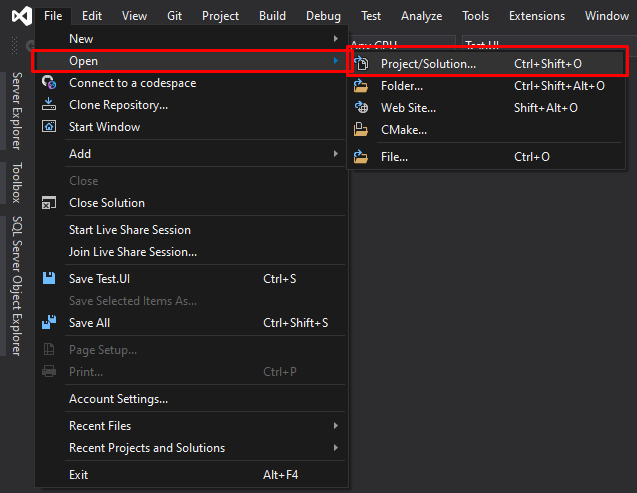
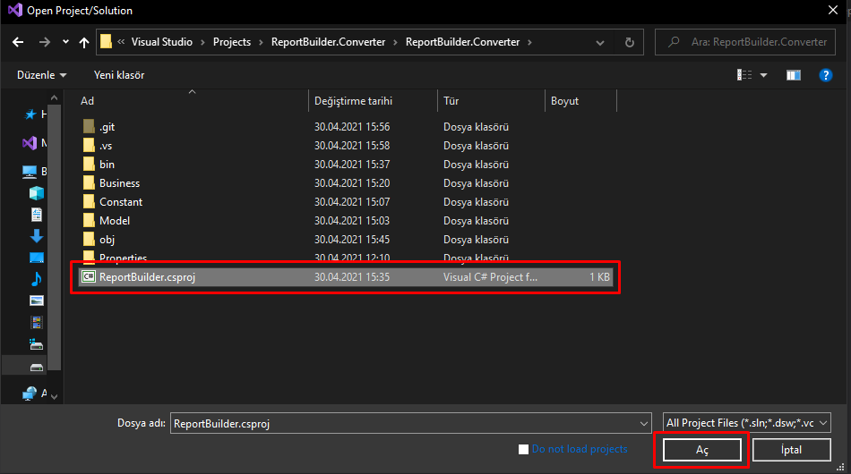
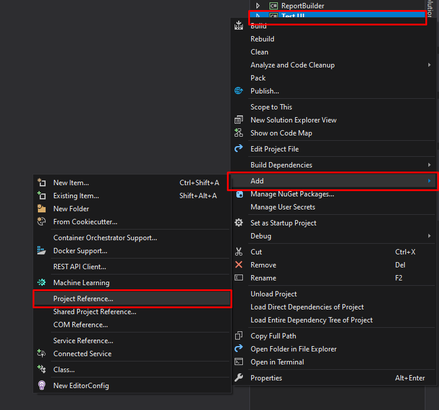
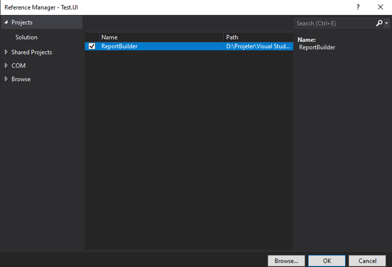

## .NET Standard Converter for "Microsoft SQL Server Report Builder"

<details>
  <summary>Get Started (with Source)</summary>
  
  * * *
  
### Open "Visual Studio" and do respectively "File - Open - Project/Solution"


### Choose "ReportBuilder.csproj"


### Right click on your own Project, "Add - Project References"


### Check "ReportBuilder" and submit "OK"


* * *

</details>

<details>
  <summary>Get Started (with DLL)</summary>
  
### Download Release <a href="https://github.com/karcan/ReportBuilder-Converter_.NET-Standard/releases">(Click)</a>
  
  * * *
  
</details>

<details>
  <summary>Usage</summary>
  * * *
  
### Usage
```CSharp
// Create instance of ReportConverter
IReportConverter reportBuilderConverter = new ReportConverter();


/*
 * PDF
 * Create bytes of PDF.
 */
var PDF = reportBuilderConverter.toByte(
    reportFilePath: @"D:\test.rdl",
    fileExtension: ReportExtension.PDF,
    paramValues: new Dictionary<string, string> { { "id", "4" } }
    );
// Create file from bytes.
File.WriteAllBytes("D:\\test\\test.pdf", PDF);

/*
 * Excel
 * Create bytes of Excel.
 */
var Excel = reportBuilderConverter.toByte(
    reportFilePath: @"D:\test.rdl",
    fileExtension: ReportExtension.Excel,
    paramValues: new Dictionary<string, string> { { "id", "4" } }
    );
// Create file from bytes.
File.WriteAllBytes("D:\\test\\test.xls", Excel);

/*
 * Word
 * Create bytes of Word.
 */
var Word = reportBuilderConverter.toByte(
      reportFilePath: @"D:\test.rdl",
      fileExtension: ReportExtension.Word,
      paramValues: new Dictionary<string, string> { { "id", "4" } }
      );
// Create file from bytes.
File.WriteAllBytes("D:\\test\\test.doc", Word);

/*
 * Image
 * Create bytes of Image.
 */
var Image = reportBuilderConverter.toByte(
      reportFilePath: @"D:\test.rdl",
      fileExtension: ReportExtension.Image,
      paramValues: new Dictionary<string, string> { { "id", "4" } }
      );
// Create file from bytes.
File.WriteAllBytes("D:\\test\\test.jpg", Image);
```
</details>
